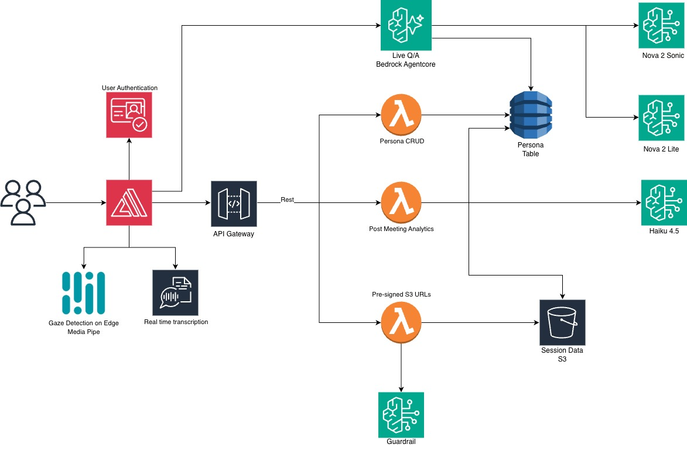

# AI Presentation Analyzer

An AI-powered presentation coaching tool that lets users record or upload their presentation, receive a live voice-based Q&A session with a configurable AI persona, and then review detailed post-session analytics — all built on a fully serverless AWS architecture.

---

## Visual Demo

[Watch the full walkthrough of the AI Presentation Analyzer in action](https://drive.google.com/file/d/10Pk6qEWwBwCO9xxWBtK4-kOi8Jtl3oln/view?usp=drive_link)

---

## Table of Contents

| Index                                               | Description                                             |
| :-------------------------------------------------- | :------------------------------------------------------ |
| [High Level Architecture](#high-level-architecture) | High level overview illustrating component interactions |
| [Deployment Guide](#deployment-guide)               | How to deploy the project                               |
| [User Guide](#user-guide)                           | End-user instructions and walkthrough                   |
| [API Documentation](#api-documentation)             | Documentation on the APIs the project uses              |
| [Directories](#directories)                         | General project directory structure                     |
| [Modification Guide](#modification-guide)           | Guide for developers extending the project              |
| [Credits](#credits)                                 | Contributors and acknowledgments                        |
| [Disclaimers](#disclaimers)                         | Important disclaimers and legal notices                 |
| [License](#license)                                 | License information                                     |

---

## High Level Architecture

The application is split into a Next.js frontend hosted via AWS Amplify and a serverless AWS backend. Users authenticate through Amazon Cognito, upload presentation videos directly to S3 using presigned URLs, and stream real-time transcription via Amazon Transcribe. A bidirectional voice Q&A session is powered by a containerized Strands agent running on Amazon Bedrock AgentCore, which uses Amazon Nova Sonic for speech-to-speech interaction. After each session, post-meeting analytics are generated by invoking Amazon Bedrock through a dedicated Lambda function. Personas — which define the AI interviewer's personality, voice, and time limits — are stored in DynamoDB and managed through a Cognito-protected REST API.



For a detailed explanation of the architecture, see the [Architecture Deep Dive](./docs/architectureDeepDive.md).

---

## Deployment Guide

There are two ways to deploy this application:

| Method                      | Best For                       | Requirements                          |
| :-------------------------- | :----------------------------- | :------------------------------------ |
| **Automated** (`deploy.sh`) | Quick setup via AWS CloudShell | Bash, AWS CLI                         |
| **Manual** (CDK CLI)        | Full local control             | Node.js 18+, CDK, Docker, Python 3.13 |

Quick start with the automated method:

```bash
chmod +x deploy.sh
./deploy.sh
```

The script runs in AWS CloudShell (or any bash terminal with AWS CLI configured), creates a CodeBuild project, and deploys all four stacks in about 15–25 minutes.

For detailed deployment instructions, including prerequisites, GitHub token setup, manual CDK deployment, post-deployment frontend configuration, and cleanup, see the [Deployment Guide](./docs/deploymentGuide.md).

---

## User Guide

For detailed usage instructions with screenshots, see the [User Guide](./docs/userGuide.md).

---

## API Documentation

For complete API reference, see the [API Documentation](./docs/APIDoc.md).

---

## Modification Guide

For developers looking to extend or modify this project, see the [Modification Guide](./docs/modificationGuide.md).

---

## Directories

```
├── backend/
│   ├── bin/
│   │   └── backend.ts
│   ├── lambda/
│   │   ├── s3-presigned-url-gen/
│   │   ├── persona-crud/
│   │   ├── post-meeting-analytics/
│   │   └── layers/
│   ├── lib/
│   │   ├── backend-stack.ts
│   │   ├── agentcore-stack.ts
│   │   ├── amplify-hosting-stack.ts
│   │   └── frontend-config-stack.ts
│   ├── agentcore/
│   │   └── index.py
│   ├── cdk.json
│   ├── package.json
│   └── tsconfig.json
├── frontend/
│   ├── app/
│   │   ├── layout.tsx
│   │   ├── page.tsx
│   │   ├── globals.css
│   │   ├── components/
│   │   ├── hooks/
│   │   ├── services/
│   │   ├── context/
│   │   ├── config/
│   │   ├── transcription/
│   │   ├── practice/
│   │   └── qa/
│   └── package.json
├── docs/
│   ├── architectureDeepDive.md
│   ├── deploymentGuide.md
│   ├── userGuide.md
│   ├── APIDoc.md
│   ├── modificationGuide.md
│   └── media/
│       ├── ArchitectureDiagram.jpg
│       └── user-interface.gif
├── LICENSE
└── README.md
```

### Directory Explanations:

1. **backend/** - Contains all backend infrastructure and serverless functions
   - `bin/` - CDK app entry point
   - `lambda/` - AWS Lambda function handlers (kebab-case dirs, each with `index.py` entry point)
     - `s3-presigned-url-gen/` - Generates presigned S3 URLs for video and PDF uploads, and applies the Bedrock Guardrail to persona customizations
     - `persona-crud/` - CRUD operations for AI personas stored in DynamoDB
     - `post-meeting-analytics/` - Generates full post-session presentation analytics via Amazon Bedrock
     - `layers/` - Shared Lambda layers (e.g., latest boto3)
   - `lib/` - CDK stack definitions (auth, API, AgentCore runtime, Amplify hosting, frontend config)
   - `agentcore/` - Containerized bidirectional voice Q&A agent built with Strands and deployed on Amazon Bedrock AgentCore

2. **frontend/** - Next.js frontend application (App Router, TypeScript, Tailwind CSS)
   - `app/` - Next.js App Router pages and layouts
   - `components/` - Reusable UI components (persona selection, upload, practice session, Q&A, analytics)
   - `hooks/` - Custom React hooks
   - `services/` - API clients, AWS credential helpers, WebSocket connection management
   - `transcription/` - Real-time transcription providers (Amazon Transcribe and Web Speech API)
   - `practice/` and `qa/` - Dedicated pages for practice sessions and live Q&A

3. **docs/** - Project documentation
   - `media/` - Images, diagrams, and GIFs for documentation

---

## Credits

This application was developed by:

- <a href="https://www.linkedin.com/in/shakthiarun22/" target="_blank">Shakthi Arun</a>
- <a href="https://www.linkedin.com/in/sreeram-s-5454961aa/" target="_blank">Sreeram Saravana Prasad</a>
- <a href="https://www.linkedin.com/in/aadityajindal12/" target="_blank">Aaditya Jindal</a>
- <a href="https://www.linkedin.com/in/aryankhanna2004/" target="_blank">Aryan Khanna</a>

---

## Disclaimers

Customers are responsible for making their own independent assessment of the information in this document. This document:

(a) is for informational purposes only,

(b) references AWS product offerings and practices, which are subject to change without notice,

(c) does not create any commitments or assurances from AWS and its affiliates, suppliers or licensors. AWS products or services are provided "as is" without warranties, representations, or conditions of any kind, whether express or implied. The responsibilities and liabilities of AWS to its customers are controlled by AWS agreements, and this document is not part of, nor does it modify, any agreement between AWS and its customers, and

(d) is not to be considered a recommendation or viewpoint of AWS.

Additionally, you are solely responsible for testing, security and optimizing all code and assets on GitHub repo, and all such code and assets should be considered:

(a) as-is and without warranties or representations of any kind,

(b) not suitable for production environments, or on production or other critical data, and

(c) to include shortcuts in order to support rapid prototyping such as, but not limited to, relaxed authentication and authorization and a lack of strict adherence to security best practices.

All work produced is open source. More information can be found in the GitHub repo.

---

## License

This project is licensed under the MIT License - see the [LICENSE](./LICENSE) file for details.
