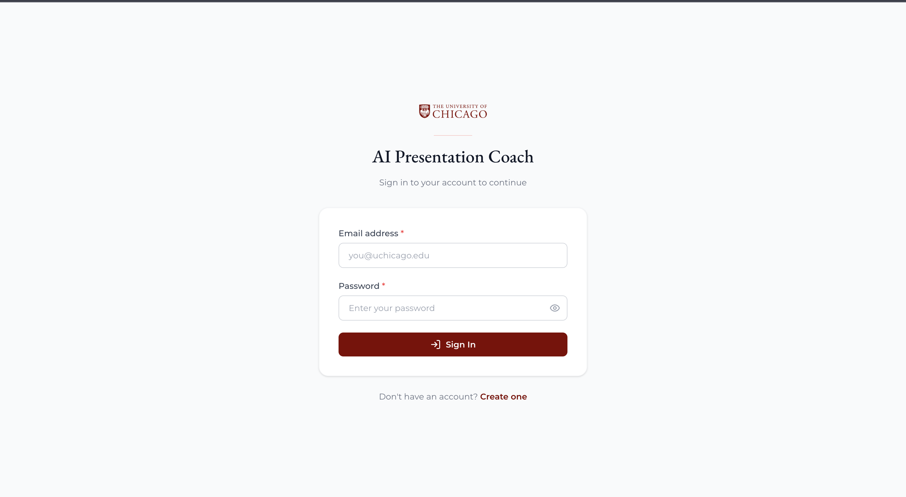
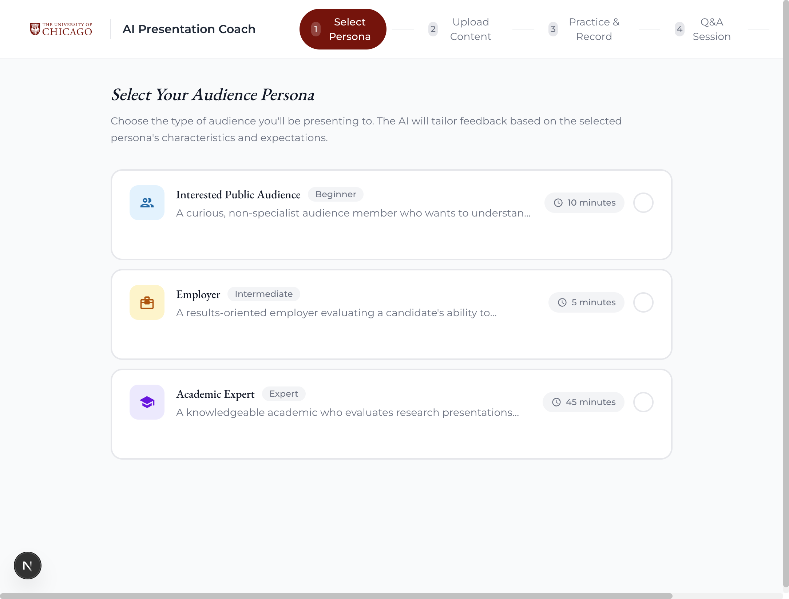
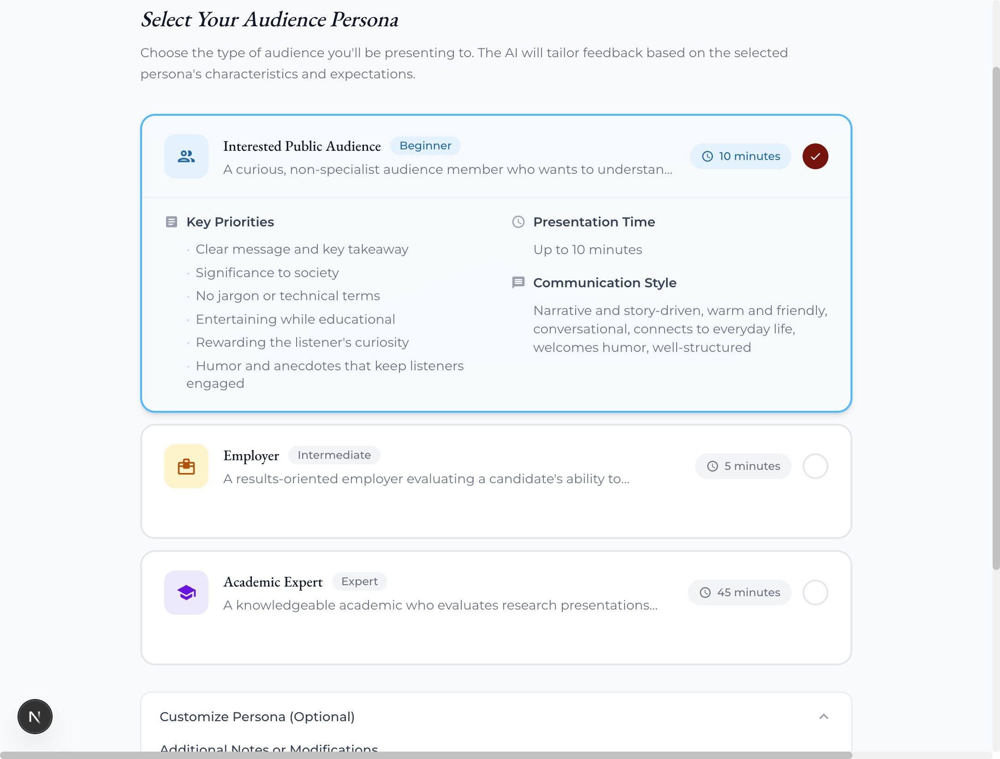
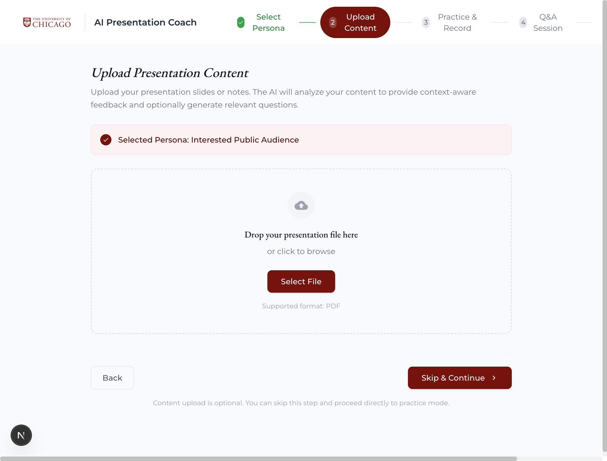
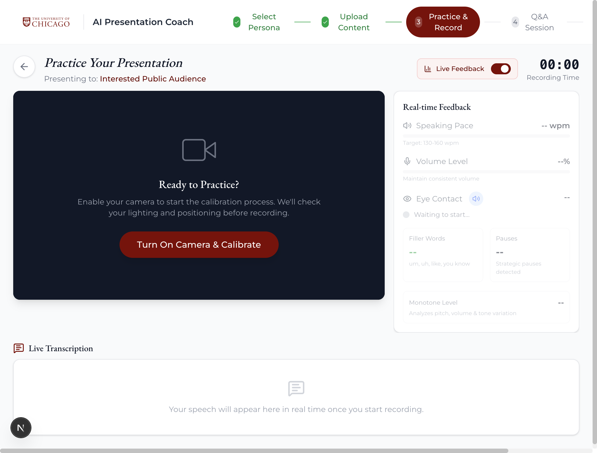
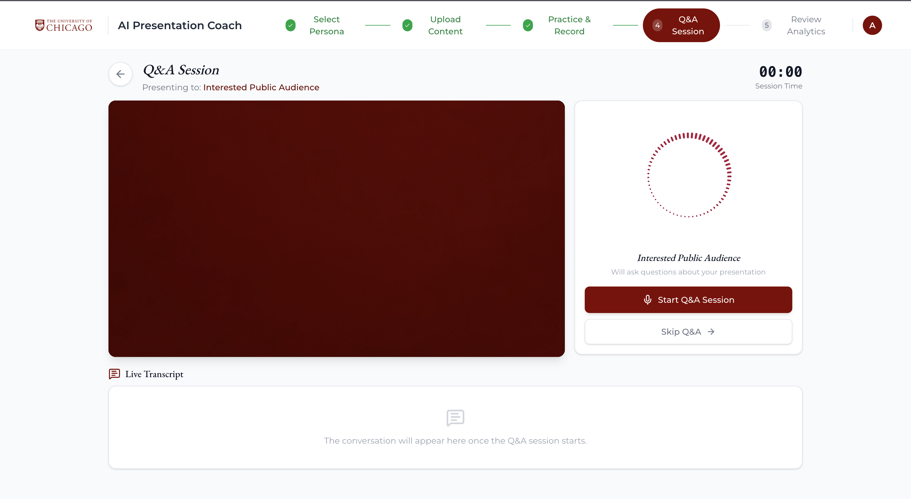

# User Guide

This guide provides step-by-step instructions for using the AI Presentation Analyzer.

---

## Prerequisites

**Please ensure the application is deployed before proceeding.**

See the [Deployment Guide](./deploymentGuide.md) for deployment instructions.

---

## Introduction

The AI Presentation Analyzer is a presentation coaching tool that helps you practice and improve your presentations through AI-powered feedback. You record yourself presenting, go through a live voice-based Q&A session with a configurable AI persona, and then receive detailed analytics on your delivery and content — all in one workflow.

### Key Features
- **Real-time transcription** during your practice session with filler word detection
- **On-device eye contact and delivery metrics** tracked throughout your presentation
- **Live voice Q&A** with a configurable AI persona powered by Amazon Nova 2 Sonic
- **Post-session analytics** with AI-generated recommendations, delivery scores, and a timestamped feedback log
- **PDF report export** of your full session analytics
- **Customizable personas** so you can practice for a specific audience (e.g. investors, technical reviewers, professors)

---

## Getting Started

### Step 1: Access the Application

Navigate to the application URL provided after deployment. You will land on the sign-in page.

If you do not have an account, click **Sign Up**, enter your email address and a password, and verify your email using the confirmation code sent to your inbox. Once verified, sign in with your credentials.

---

### Step 2: Select a Persona

After signing in you will be prompted to select a persona for your session. Personas define the character and behavior of the AI interviewer during your Q&A — their communication style, areas of focus, and how long the Q&A will run.

- Browse the available persona cards and read their descriptions
- Click on a persona to select it — the card expands to show Key Priorities, Presentation Time, and Communication Style

- Click **Continue** to proceed to session setup

> **Note:** Personas are managed by administrators. If you do not see a persona suited to your needs, contact your system administrator.

---

### Step 3: Add Custom Instructions (Optional)

You can type free-form instructions to tailor the AI's behavior specifically for your session. For example:
- *"Focus your questions on the financial projections in slides 4 and 5"*
- *"Ask me at least one challenging follow-up question per topic"*
- *"I am pitching to a non-technical audience, adjust your questions accordingly"*

- Type your instructions in the text box
- Click **Save** — the text is scanned by a content safety filter before being saved
- You can edit and re-save at any point before starting the session
- Leave the field blank to rely solely on the persona's default behavior

---

### Step 4: Upload Your Presentation PDF (Optional)

Upload your slide deck as a PDF to give the AI additional context about your presentation content when generating post-session feedback.

- Click **Upload PDF** and select your slide deck file
- The file uploads directly to secure cloud storage — you will see a confirmation once it completes
- Supported format: PDF only
- This step is optional but recommended — when a PDF is provided, the AI can reference your actual slide content in its feedback

---

### Step 5: Run Your Practice Session

With your session configured, click **Start Session** to begin recording. Grant the browser permission to access your camera and microphone when prompted.

During the session you will see:

- **Camera view** — Live feed from your webcam used for eye contact tracking
- **Transcription panel** — Your speech transcribed in real time, including filler words such as "um" and "uh"
- **Real-time feedback panel** — Live indicators for speaking pace, volume level, eye contact score, filler word count, and pauses
- **Feedback log** — Timestamped events flagged when a metric falls outside the recommended range for your selected persona

**During the session:**
- Speak naturally and present as you normally would
- Watch the real-time feedback panel to self-correct during the session
- The session recording, transcript, and all delivery metrics are captured automatically

**To end the session:**
- Click **Stop Recording** when you have finished presenting
- Your recording, transcript, and analytics are automatically uploaded to the cloud

---

### Step 6: Live Q&A Session

After your practice session ends, you will be taken to the live Q&A screen. The AI persona you selected will conduct a spoken Q&A based on your presentation transcript.

- Click **Start Q&A** to connect to the AI — you will see an animated orb indicating the agent is active
- The AI will introduce itself and ask its first question automatically
- **Speak your answers directly** — the session is fully voice-based, no typing required
- The live transcript panel shows both the AI's questions and your answers in real time
- The session runs for the time limit configured by your persona (default: 5 minutes)
- When time is running low the AI will naturally wrap up the conversation

**To end the Q&A early:**
- Click **End Session** — the AI will generate your Q&A analytics before the connection closes

---

### Step 7: Review Your Analytics

After both the practice session and Q&A are complete, you are taken to the analytics review page. The AI generates a full assessment of your session.

The review page contains:

**Overall Score**
A composite delivery score calculated from your eye contact, speaking pace, volume, filler words, and pauses — weighted according to the persona's priorities.

**Performance Summary**
A 2–3 sentence overall assessment of your presentation written by the AI, followed by your key content strengths.

**Key Recommendations**
Five specific, actionable recommendations focused on your content — structure, clarity, argument depth, and delivery. Each recommendation includes a 3-sentence explanation.

**Delivery Feedback**
Per-metric AI commentary on your speaking pace, volume, eye contact, filler word usage, and pauses — each with an observation and a concrete improvement tip.

**Timestamped Feedback Log**
A timeline of moments during your presentation where a delivery metric fell outside the recommended range. Click a timestamp to jump to that point in the recording playback.

**Q&A Performance**
The AI's assessment of how well you answered the persona's questions, including an overall rating (Excellent / Good / Needs Improvement), strengths, areas for improvement, and a per-question breakdown (Strong / Adequate / Weak).

**Session Recording Playback**
Watch your recorded presentation back with the timestamped feedback log alongside it.

**Download Report**
Click **Download PDF Report** to export a full summary of your session analytics as a PDF.

---

## Frequently Asked Questions (FAQ)

### Q: Why does the transcription sometimes miss words?
**A:** Transcription accuracy depends on microphone quality, background noise, and speaking clarity. Use a headset or external microphone in a quiet environment for best results. The system uses Amazon Transcribe, which is significantly more accurate than the browser's built-in speech recognition — particularly for filler words like "um" and "uh".

### Q: Can I redo a session?
**A:** Yes. Each time you go through the full flow a new session is created with its own independent analytics. Previous session data is not overwritten.

### Q: How long does it take for the post-session analytics to generate?
**A:** Analytics typically generate within 15–30 seconds. If the page shows "Processing...", wait a few seconds and the results will appear automatically. The system polls in the background — you do not need to refresh the page.

### Q: Can I download my analytics?
**A:** Yes. Click the **Download PDF Report** button on the analytics review page to export a full report including your scores, AI recommendations, delivery feedback, and Q&A performance.

### Q: Who can create or edit personas?
**A:** Only users in the **Admin** group can create, edit, or delete personas. Regular users can view and select personas but cannot modify them.

### Q: Is my recording stored permanently?
**A:** Session recordings and data are stored in encrypted cloud storage and automatically deleted after 30 days.

---

## Troubleshooting

### Issue: Microphone or camera access is blocked
**Solution:** Check your browser's site permissions. In Chrome, click the lock icon in the address bar and ensure both Camera and Microphone are set to **Allow**. Reload the page after updating permissions.

### Issue: The Q&A session shows "Connection failed"
**Solution:** Your AWS session credentials may have expired. Sign out and sign back in, then try starting the Q&A session again. Ensure you have a stable internet connection as the Q&A requires a persistent WebSocket.

### Issue: Transcription is not appearing during the practice session
**Solution:** Confirm your microphone permission is granted and your selected microphone is the correct input device. Check your browser's audio input settings. If transcription still does not start, reload the page and try again.